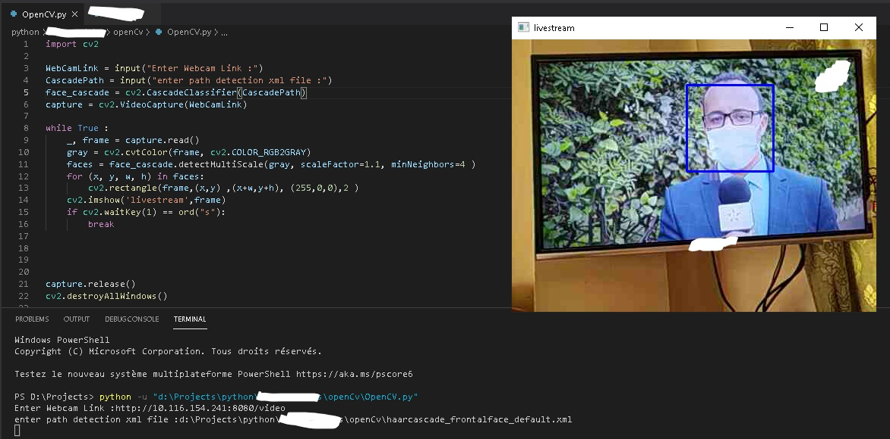
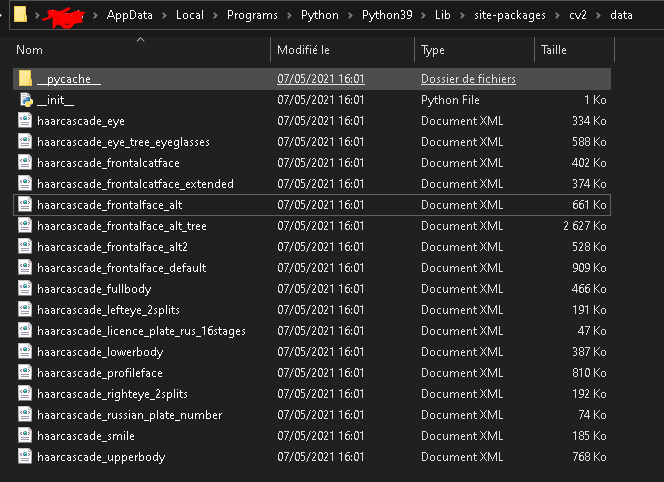

**This is Python Project using OpenCV**

- You need to install OpenCV library usin command :
```
pip install opencv-python
```





haarcascade_frontalface_default.xml is script to detect faces 
when you install the library, the xml file  will be in folder of **OpenCV** and you can find more of this xml scripts (one of faces ,one of bodys ...etc ) 


